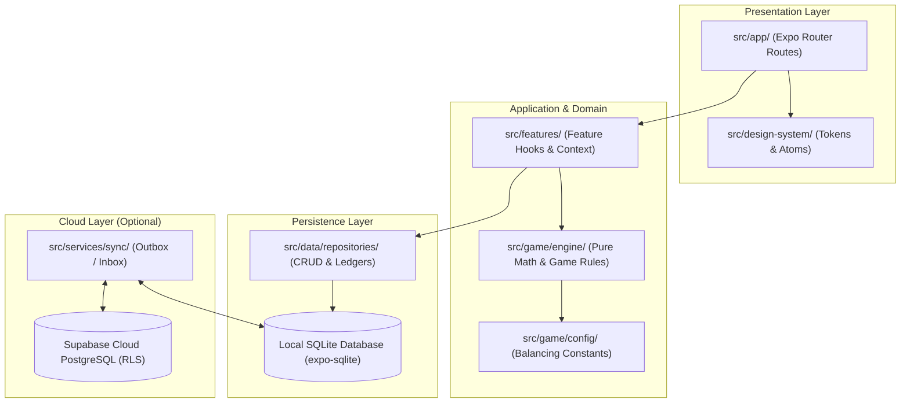

# DragonQuest

> **Offline-first, gamified personal-growth and daily-training mobile app built with Expo and React Native that transforms focus sessions, physical workouts, mindfulness, recovery, journaling, and daily habits into an RPG-style character progression experience.**

[](https://github.com/Ashutoshx29/DragonQuest/actions/workflows/ci.yml)
[](LICENSE)
[](https://docs.expo.dev/)
[](https://reactnative.dev/)
[](https://www.typescriptlang.org/)
[](https://orm.drizzle.team/)

---

## Status

DragonQuest is an **active development preview**. The core application is fully operational and has been verified on connected Android hardware and through automated test suites (17 test suites, 169 unit tests, and database constraints smoke tests).

---

## What DragonQuest Does

DragonQuest replaces traditional disconnected to-do lists and habit trackers with an integrated, proof-of-effort training progression model. Real-world physical, mental, and productive accomplishments directly power an in-game avatar across five core RPG attributes:

- ⚔️ **Power**: Built through physical workouts, strength training, and exercise logging.
- 🎯 **Focus**: Built through deep-work focus sessions and distraction-free countdown timers.
- 🛡️ **Discipline**: Built through daily habit consistency, routine completions, and streak multipliers.
- 🧠 **Mind**: Built through guided breathwork pacing, mindfulness, and reflective daily journaling.
- ⚡ **Energy**: Built through recovery breathing exercises, morning/evening rituals, and active streak maintenance.

All character progression—total XP, level thresholds, attribute distributions, and streaks—is **mathematically derived** from immutable, append-only event ledgers stored directly on the device.

---

## Core Features

### ⏱️ Training Chamber & Focus Timer
- **Multi-Modal Timer**: Supports both countdown and stopwatch modes for deep-work focus blocks.
- **Wall-Clock Drift Recovery**: Calculates elapsed time dynamically from timestamp deltas (`now - startedAt - pausedDuration`). If the app is backgrounded or the screen is locked, the timer self-corrects instantly upon foregrounding with zero drift.
- **Zero-XP Abort Protection**: Ending a timer with under 1 second elapsed routes safely to the discard flow, preventing accidental zero-effort rewards.

### 🏋️ Physical Workout Logging
- **Set & Rep Tracking**: Log strength workouts with exercise names, sets, repetitions, and weight load.
- **Power Progression**: Automatically awards Power attribute XP upon workout completion.
- **Interactive Sheets**: Clean bottom sheets for rapid logging without leaving the training view.

### 🧘 Guided Breathwork & Mind Training
- **Pacing Engine**: Interactive guided breathing cycles with visual rhythm indicators:
  - *Box Breathing* (4s Inhale, 4s Hold, 4s Exhale, 4s Hold)
  - *4-7-8 Relaxing Breath* (4s Inhale, 7s Hold, 8s Exhale)
  - *Coherent Pacing* (5.5s Inhale, 5.5s Exhale)
- **Reflective Daily Journaling**: Single-entry-per-day reflective writing awarding +30 Mind XP, protected against accidental double-submission races.

### 🛡️ Quests, Habits & Routines
- **Daily Habit Tracking**: Check off daily positive habits and track consecutive day streaks.
- **Routine Bundles**: Group morning, evening, or workout routines into sequential checklist items.
- **Task Management**: Flexible one-off tasks with priority, difficulty multipliers, and XP gains.
- **Streak Protection**: Streak multipliers at 7, 30, and 100 days, with support for earnable freeze tokens.

### 📜 Deterministic Daily Missions & Programs
- **Seeded Daily Missions**: Generates three unique daily missions seeded deterministically from the calendar date (`YYYY-MM-DD`). Consistent across all devices without needing a network request.
- **Chest Reward**: Unlocks a daily bonus chest when all three daily missions are completed.
- **Multi-Day Programs**: Join 7, 14, or 30-day training challenges with checkpoint milestones and atomic XP awards.

### 👤 Avatar Evolution & RPG Mechanics
- **Progression Curve**: Deterministic level curve formula:
  $$\text{XP}_{\text{level}} = \text{round}(100 \times (n - 1)^{1.6})$$
- **Dynamic Avatars**: Avatars evolve visually through character stages (*Neophyte* $\to$ *Ember* $\to$ *Guardian* $\to$ *Sage*) as total level milestones are unlocked.
- **Achievement Gallery**: 15 distinct achievements evaluated dynamically against ledger history.

### 💾 Offline-First Architecture & Cloud Sync
- **Local SQLite Driver**: Operates 100% offline out-of-the-box using `expo-sqlite` and `drizzle-orm`. The UI never awaits network roundtrips.
- **Optional Supabase Cloud Mirror**: Background outbox/inbox synchronization mirrors local records to cloud PostgreSQL with strict Row Level Security (`auth.uid() = user_id`).
- **Sync Hardening**: Includes runtime DTO key conversion (`rowMapping.ts`), natural-key duplicate absorption (preventing Postgres `23505` conflicts), and exponential retry backoff.

---

## Device & Visual Verification

The application is actively tested on physical Android devices. Layouts, touch targets, and motion dynamics have been verified:
- **Responsive Insets**: Strict edge-to-edge layout honoring system status bars and gesture navigation bars.
- **Spring Physics**: Fluid, non-blocking UI interactions powered by React Native Reanimated worklets.
- **Dark-Theme Design Tokens**: High-contrast, energy-efficient dark color palette (`#07080C` background) optimized for mobile OLED screens.

*A full media showcase and walkthrough video are being prepared for the upcoming pre-release milestone.*

---

## Tech Stack

| Component | Technology | Version | Purpose |
| :--- | :--- | :--- | :--- |
| **Runtime** | React Native | `0.86.3` | Cross-platform native mobile foundation |
| **Framework** | Expo SDK | `~57.0.25` | Managed workflow with Continuous Native Generation (CNG) |
| **UI Library** | React | `19.2.3` | Component model |
| **Language** | TypeScript | `~6.0.3` | Strict type checking (`strict: true`) |
| **Routing** | Expo Router | `~57.0.23` | File-based navigation with typed routes |
| **Local Database** | Expo SQLite | `~57.0.3` | Synchronous SQLite driver (`openDatabaseSync`) |
| **ORM & Migrations** | Drizzle ORM | `^0.45.3` | Type-safe schema definition and querying |
| **Cloud Backend** | Supabase JS | `^2.117.2` | Optional cloud authentication, mirror, and RLS |
| **Animation** | React Native Reanimated | `4.5.1` | Native thread gestures and spring animations |
| **Haptics** | Expo Haptics | `~57.0.3` | Semantic tactile vibration feedback |
| **Testing** | Jest & Jest-Expo | `~29.7.0` | Comprehensive test suite (169 passing unit tests) |

---

## Architecture

DragonQuest enforces a clean boundary between presentation, application hooks, pure game engines, and persistence:



For complete details on entity relationships, sync mechanics, and ADRs, consult the **[System Architecture Specification](docs/ARCHITECTURE.md)**.

---

## Project Structure

```
DragonQuest/
├── .github/                         # GitHub Actions CI & community issue templates
├── assets/                          # App icons, splash graphics, and branding assets
├── docs/                            # Architectural specs and onboarding documentation
│   ├── ARCHITECTURE.md              # Detailed system architecture specification
│   ├── DRAGONQUEST-HANDOVER.md      # Comprehensive 28-section engineering dossier
│   └── README.md                    # Documentation index and navigation hub
├── scripts/                         # Database verification and build smoke scripts
│   └── sqlite-smoke.mjs             # Dev-machine SQLite constraint validation test
├── src/
│   ├── app/                         # Expo Router screens (routes only, thin UI)
│   ├── constants/                   # Application-wide constants & branding strings
│   ├── data/                        # SQLite client, Drizzle schema, and repositories
│   ├── design-system/               # Design tokens, theme colors, and UI primitives
│   ├── features/                    # Domain feature modules (Training, Auth, Quests, etc.)
│   ├── game/                        # Pure deterministic game engines and tuning configs
│   ├── lib/                         # Pure utility helpers (calendar dates, Supabase client)
│   └── services/                    # Cross-cutting services (logger, haptics, sync)
├── supabase/                        # Cloud migrations and Supabase PostgreSQL config
├── AGENTS.md                        # Strict agent workflows & engineering invariants
├── CLAUDE.md                        # AI development ecosystem & prompt guidelines
├── CONTRIBUTING.md                  # Contribution rules and development gates
└── SECURITY.md                      # Security disclosure policy and RLS overview
```

---

## Getting Started

### Prerequisites
- **Node.js**: `20.x` or `22.x` LTS
- **Package Manager**: `npm`
- **Mobile Device or Emulator**: Physical phone with **Expo Go** installed (recommended) or an Android Studio Emulator / iOS Simulator.

### 1. Installation
```bash
git clone https://github.com/Ashutoshx29/DragonQuest.git
cd DragonQuest
npm install
```

### 2. Environment Setup (Optional)
DragonQuest is **offline-first by default**. It runs 100% locally without cloud credentials. If you wish to test cloud synchronization:
```bash
cp .env.example .env.local
```
Fill in your public Supabase project credentials in `.env.local`:
```ini
EXPO_PUBLIC_SUPABASE_URL=https://your-project.supabase.co
EXPO_PUBLIC_SUPABASE_PUBLISHABLE_KEY=your-anon-publishable-key
```
> [!NOTE]
> Never commit `.env.local`. Client builds only accept the public publishable key; row level security (RLS) protects user records.

### 3. Start the Development Server
```bash
npx expo start
```
- Scan the displayed QR code with the **Expo Go** app on Android or iOS.
- Press `a` in the terminal to launch the Android emulator.
- Press `w` in the terminal to launch the web preview.

---

## Verification & Testing

Before committing changes, run the local 5-gate verification suite:

```bash
# 1. Typecheck: Verify strict TypeScript (0 errors)
npm run typecheck

# 2. Lint: Run ESLint flat configuration
npm run lint

# 3. Database Constraints Smoke Test: Test SQLite migrations & indices
npm run smoke:db

# 4. Unit & Engine Tests: Run Jest test suite (17 suites, 169 tests)
npm test

# 5. Web Export Verification: Verify static bundle export
npx expo export --platform web
```

---

## Project Documentation Index

| Guide | Description |
| :--- | :--- |
| **[Architecture Specification](docs/ARCHITECTURE.md)** | Deep architectural walkthrough, entity relationships, and timer state machines. |
| **[Handover Dossier](docs/DRAGONQUEST-HANDOVER.md)** | Definitive 28-section engineering onboarding dossier with ADRs. |
| **[Documentation Hub](docs/README.md)** | Central index of all documentation files. |
| **[Contributing Guide](CONTRIBUTING.md)** | Development workflow, code standards, and PR requirements. |
| **[Security Policy](SECURITY.md)** | Vulnerability reporting, RLS enforcement, and secret protection. |
| **[Bug Backlog](BUG-BACKLOG.md)** | Active bug backlog and issue tracking. |
| **[Pre-Run Readiness](PRE-RUN-READINESS.md)** | Verification gate record documenting verified fixes and quality checks. |
| **[Overengineering Review](OVERENGINEERING-REVIEW.md)** | Simplicity audit keeping code clean, lean, and maintainable. |

---

## Roadmap

- [x] **Phase 1: Project Foundation** — Expo SDK 57, TypeScript strict, ESLint/Prettier, navigation skeleton.
- [x] **Phase 2: Design System** — Themed atoms, spring motion presets, semantic haptics, logger.
- [x] **Phase 3: Local Persistence** — SQLite driver, Drizzle ORM schema, habit/routine/task repositories.
- [x] **Phase 4: XP Progression & Missions** — Deterministic level curve, daily missions, XP event bus.
- [x] **Phase 5: Goals, Achievements & Stats** — Goal milestones, 15 achievement badges, multi-day challenges.
- [x] **Phase 6: Cloud Sync & Training Rebuild** — Supabase Auth, outbox/inbox cloud sync, physical workout tracking, recovery breathing, timer chamber modular sheets.
- [ ] **Phase 7: Cloud Sync UI Unification** — Centralized sync status banner and query invalidation.
- [ ] **Phase 8: Local Notifications** — Scheduled habit reminders and streak freeze alerts.
- [ ] **Phase 9: Audio & Animation Juice** — Lottie celebration ceremonies and custom audio soundscapes.
- [ ] **Phase 10: End-to-End Automation** — Automated Maestro test flows on physical device farms.
- [ ] **Phase 11: Production Release** — Rebranding pass, EAS cloud builds, and Google Play / TestFlight deployment.

---

## Known Limitations

- **Sync Status Banner (Profile)**: The failure banner on the Profile screen currently reflects the last manual sync trigger rather than the automatic background retry pass until manually triggered (tracked in `BUG-BACKLOG.md §S1`).
- **Raw Auth Error Copy**: Transport-level auth errors are caught cleanly, while select raw Supabase error messages are scheduled for friendly copy mapping (tracked in `BUG-BACKLOG.md §A2`).

---

## Contributing

We welcome contributions! Please review our **[Contributing Guidelines](CONTRIBUTING.md)** before opening a pull request. Make sure all 5 verification gates pass cleanly.

---

## License

This project is licensed under the **MIT License** — see the [LICENSE](LICENSE) file for details.

---

## Disclaimer

*DragonQuest* is an **internal engineering working title**. The application will be rebranded prior to public store publication to prevent trademark conflicts. All public-facing branding strings are isolated in configuration files (`src/constants/index.ts`, `app.json`) for seamless rebranding without affecting database schemas or game systems.
