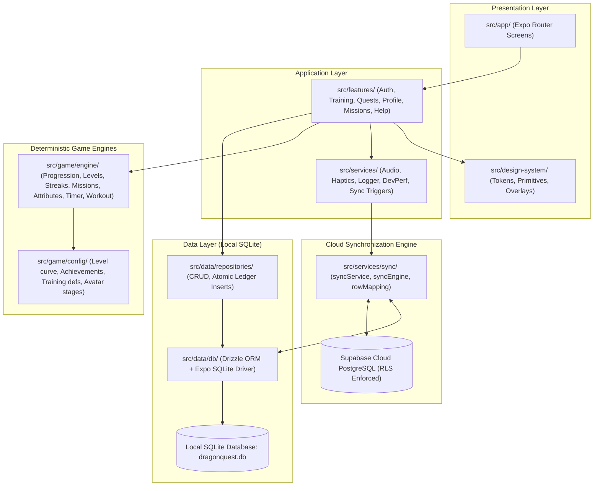
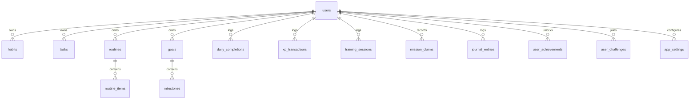
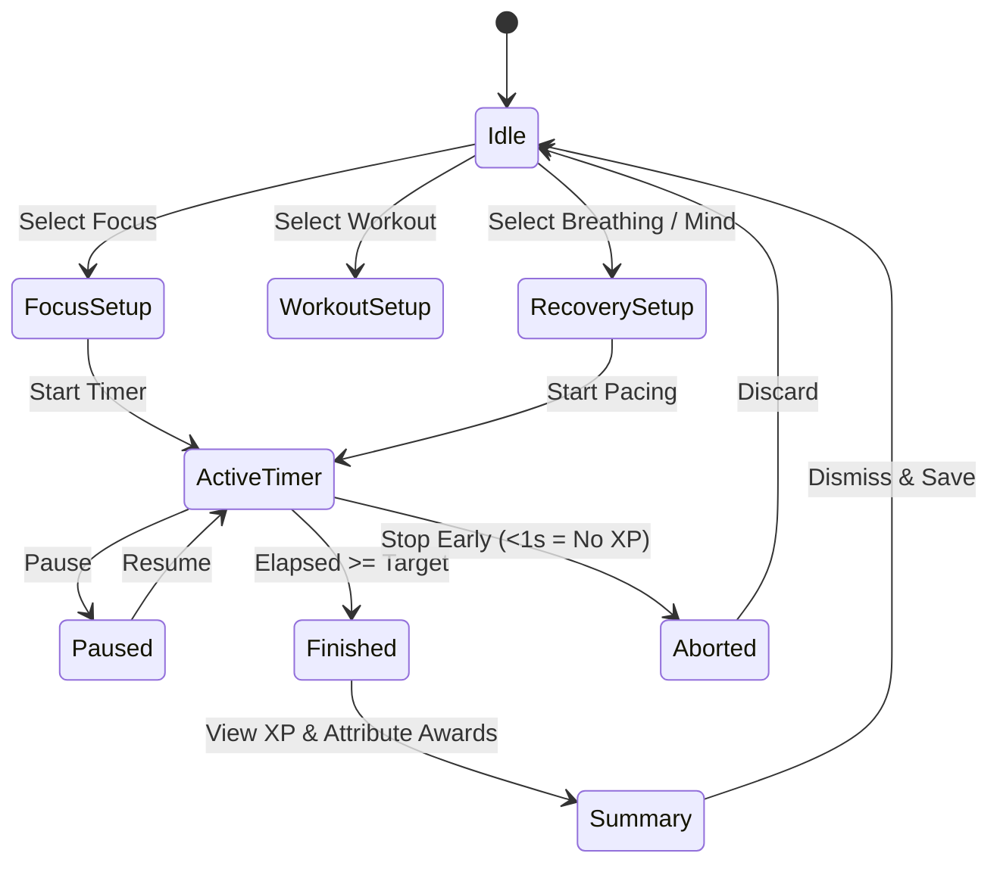
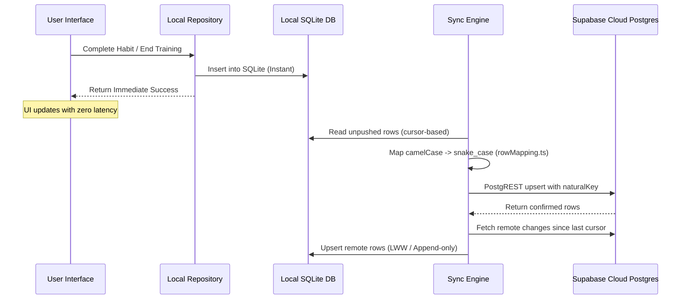

# DragonQuest — System Architecture

> **Definitive Technical Architecture Specification**  
> **Application:** DragonQuest · **Framework:** Expo SDK 57 (Managed) / React Native 0.86 / React 19 / TypeScript 6  
> **Architecture Style:** Offline-First, Local-Authoritative, Deterministic Domain Engines, Asynchronous Cloud-Mirrored

---

## 1. System Topology & Layered Architecture

DragonQuest operates on a strict layered topology ensuring that UI interactions never block on network operations, state derivations remain deterministic and pure, and local storage on the device is the undisputed single source of truth.



### Architectural Principles:
1. **Zero UI Network Wait**: Screens read and mutate local SQLite state synchronously and immediately. The app works flawlessly in airplane mode or unstable connections.
2. **Pure Functional Domain Engines**: All mathematical progression models, level-up calculations, timer drift corrections, and streak logic are pure TypeScript functions isolated from React, SQLite, or network dependencies.
3. **Append-Only Proof Ledgers**: XP awards, habit check-offs, physical workout sessions, and mission claims are stored in append-only ledger tables. User progression stats are derived queries, never raw mutable numbers.
4. **Idempotent Background Synchronization**: Cloud syncing is an outbox/inbox pipeline executing in the background with exponential retry backoff. Uncompleted or replayed records converge idempotently via natural-key conflict targets.

---

## 2. Technology Stack & Dependency Matrix

| Layer | Technology | Version | Purpose |
| :--- | :--- | :--- | :--- |
| **Mobile Runtime** | React Native | `0.86.3` | Mobile rendering platform |
| **UI Framework** | React | `19.2.3` | Component model |
| **Application SDK** | Expo SDK | `~57.0.25` | Managed workflow with Continuous Native Generation (CNG) |
| **Language** | TypeScript | `~6.0.3` | Strict type validation (`strict: true`, path alias `@/*`) |
| **Routing** | Expo Router | `~57.0.23` | File-based routing with typed routes |
| **Local Database** | Expo SQLite | `~57.0.3` | Native SQLite driver (`openDatabaseSync`) |
| **ORM / Migration** | Drizzle ORM / Kit | `^0.45.3` / `^0.31.11` | Type-safe schema definition and migration bundle |
| **Cloud Backend** | Supabase JS | `^2.117.2` | Authentication, PostgreSQL mirror, and RLS |
| **Animation Engine** | React Native Reanimated | `4.5.1` | Native thread UI animations and worklet execution |
| **Tactile Feedback** | Expo Haptics | `~57.0.3` | Semantic tactile feedback for presses and timers |
| **Testing** | Jest & Jest-Expo | `~29.7.0` / `~57.0.5` | Unit and feature test runner (17 suites, 169 tests) |

---

## 3. Offline-First, Local-Authoritative Data Model

The device's local database (`dragonquest.db`) holds the authoritative state.



### Key Schema Entities:
- **`daily_completions`**: Ledger of completions (`entity_type`: `habit`, `task`, `routine_item`, or `milestone`) by local calendar day (`YYYY-MM-DD`).
- **`xp_transactions`**: Append-only ledger recording every XP gain along with target attribute (`power`, `focus`, `discipline`, `mind`, `energy`) and source entity reference.
- **`training_sessions`**: Recorded timer sessions (Focus, Physical Workout, Breathing, Mind) capturing elapsed duration, kind, and completion status.
- **`mission_claims`**: Idempotent claim records ensuring daily missions are awarded once per calendar day.
- **`journal_entries`**: Daily reflection logs with unique day constraints.
- **`user_achievements` & `user_challenges`**: Unlocked badges and multi-day training program states.

---

## 4. Deterministic Game Engines & RPG Progression

All progression logic resides in `src/game/engine/` and depends solely on pure math and static configuration:

### 4.1 Level Curve Formula
```typescript
// src/game/config/levels.ts
// Level threshold: 100 * n^1.6
export function xpForLevel(level: number): number {
  if (level <= 1) return 0;
  return Math.round(100 * Math.pow(level - 1, 1.6));
}
```

### 4.2 The 5 Character Attributes
Every action in DragonQuest builds one of five core attributes:
- **Power**: Built via physical training workouts and weight progression.
- **Focus**: Built via timed focus sessions and deep-work objectives.
- **Discipline**: Built via habit completion streaks and daily mission completions.
- **Mind**: Built via guided meditation, breathwork, and reflective journaling.
- **Energy**: Built via recovery routines, morning/evening rituals, and streak consistency.

### 4.3 Deterministic Daily Missions
Three missions are generated deterministically per calendar date using a seed hash from the date string (`YYYY-MM-DD`). The mission selection is identical across devices without needing a server call.

---

## 5. The Training Chamber Subsystem

The Training Chamber (`src/features/training/`) provides deep work, physical training, and recovery tools:



### Wall-Clock Drift Recovery (ADR-002):
Mobile operating systems throttle JavaScript `setInterval` timers when the app is backgrounded or the screen is locked. DragonQuest's timer engine calculates elapsed time dynamically from the wall clock:
$$\text{elapsed} = (\text{now} - \text{startedAt}) - \text{pausedDuration}$$
Upon returning to the foreground, the timer instantly self-corrects with zero cumulative drift.

---

## 6. Cloud Synchronization & Supabase

The sync subsystem (`src/services/sync/`) links local SQLite storage with remote PostgreSQL on Supabase:



### Sync Hardening Highlights:
- **DTO Key Translation (`rowMapping.ts`)**: Automatically converts TypeScript camelCase properties to SQL snake_case column names using Drizzle's runtime column introspection.
- **Natural-Key Upsert Conflict Targets**: Prevents Postgres `23505` unique constraint violations by specifying natural keys (e.g. `user_id, achievement_id`) instead of relying solely on client-generated surrogate IDs.
- **Exponential Retry Backoff**: Automatic retries with exponential backoff on network failures (`5s -> 10s -> 20s...` capped at 5 minutes).

---

## 7. Authentication & Security Architecture

1. **Dual Operating Modes**:
   - **Anonymous / Offline Mode**: Default out-of-the-box experience. Operates locally with full feature set.
   - **Cloud Synced Mode**: Signs in via Supabase Auth (email/password). Associates user ID with all synchronized rows.
2. **Zero Client Secrets**:
   - No private keys or service roles are bundled into the client.
   - Only the public anonymous key (`EXPO_PUBLIC_SUPABASE_PUBLISHABLE_KEY`) is utilized.
3. **PostgreSQL Row Level Security (RLS)**:
   - All cloud tables enforce `auth.uid() = user_id`.
   - Verified session guards ensure sync operations can never read or overwrite data belonging to other accounts.

---

## 8. Verification & Testing Strategy

DragonQuest enforces a 5-gate local verification suite ensuring production reliability:

```bash
# Gate 1: Strict TypeScript verification (0 errors required)
npm run typecheck

# Gate 2: Flat ESLint rules check
npm run lint

# Gate 3: Node-native SQLite migration & constraint validation
npm run smoke:db

# Gate 4: Complete unit and engine test suite (17 suites, 169 tests)
npm test

# Gate 5: Production web bundle export verification
npx expo export --platform web
```
